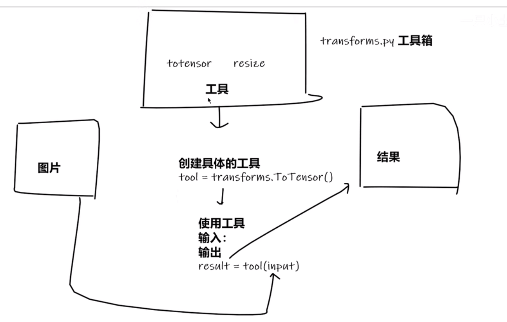

# The NOTE of Pytorch Basis
```From XIAOTUDUI```   
<https://pytorch.org/>
## About_Dataset
- Dataset: 提供一种方式去获取数据及其label
  - 如何获取每一个数据及其label
  - 告诉我们总共有多少数据
- Dataloader: 为网络提供不同的数据形式

## The_use_of_Tensorboard
- SummaryWriter
  - add_scalar(tag, scalar_value(y-axis), global_step(x-axis))
    - create a folder 'logs'(tensorboard的事件文件)
      - tensorboard --logdir=logs 
        - (--port=6007)：自定义端口
    - 会记录之前的文件拟合出奇怪的图像
  - add_image(tag, img_tensor, global_step)
    - 注意img类型(torch.tensor, numpy.array, string/blobname)
      - numpy.array: opencv
        - 注意数据格式(H,W,C) -> （C,H,W） ```add_image("test", img_array, 1, dataformats='HWC')```
- 作用
  - 可用于观察训练数据
  - 可用于观察各阶段的输出结果

## Transforms
- transforms.py工具箱
  - 图片 -> 工具(totensor, resize) -> 结果
- tensor数据类型
- 常见的transforms
  - ToTensor:图像类型转换
  - Normalize():归一化
  - Resize()：尺寸修改
  - Compose:合并操作，还是需要注意数据类型
  - RandomCrop:随机裁剪
- 关注输入和输出类型

## dataset_in_torchvision
- 从torchvision中导入官方提供数据集

## Dataloader
- 查看官方文档<https://pytorch.org/tutorials/beginner/basics/data_tutorial.html?highlight=dataloader>
  - droplist = True:对舍去
  - batch_size:一次取出多少数据
  
## nn.Module
- 了解其基本股价